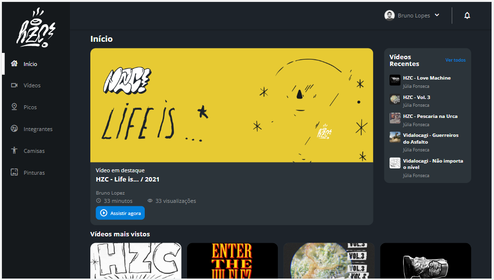
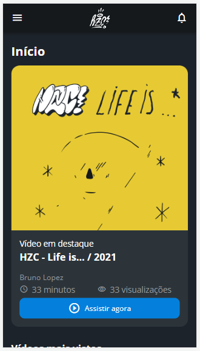

# Projeto HZC - Comunidade de Skate

Projeto desenvolvido no curso de flexbox e grid da Alura. 

O projeto foi construído utilizando a técnica mobile first e com padrão de nomenclatura de classes BEM.
 

Contém algumas alterações como estilizações e refatoração de código.

## 💻 Layout  

Toda a estilização usada no projeto pode ser encontrada no figma
[(Link do projeto).](https://www.figma.com/file/ibWktwVpnog76rMYOdVhks/Dispondo-elementos-com-flexbox-e-grid?node-id=54%3A2358)

### Web

  

### Mobile

  

 ## 🔧 Tecnologias 

As tecnologias usadas foram: 
* HTML
* CSS
* JavaScript
